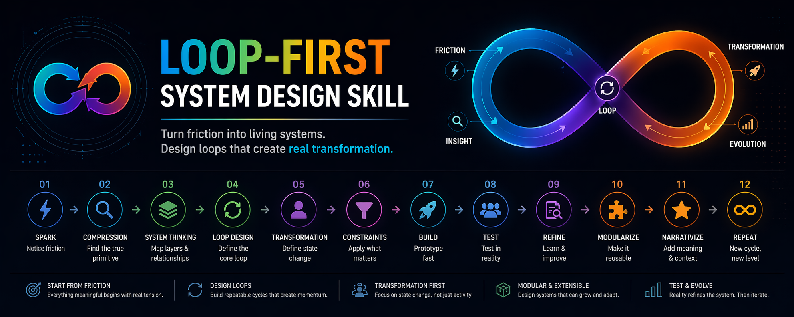

# loop-first-system-design-skill
A loop-first system design framework for turning friction into modular, real-world systems. Built for AI-assisted builders, creators, and operators.



## README.md

# 🔁 Loop-First System Design Skill

Turn friction into living systems.  
Design loops that create real transformation.

---

## What this is

A system-design and project-building skill for turning:

- raw ideas  
- recurring frustrations  
- vague ambitions  
- personal workflows  
- community gaps  

into:

- clear primitives  
- repeatable loops  
- modular systems  
- real-world prototypes  
- evolving products / programs / OS layers  

Optimized for:
- AI-assisted building  
- fast prototyping  
- real-world testing  
- iterative refinement  

---

## Core Philosophy

> Good projects are not feature collections.  
> Good projects are loops that create transformation.

---

## The Loop

```

friction → compression → system → loop → transformation
→ constraints → build → test → refine → modularize → narrativize → repeat

```

---

## Principles

### 1. Start from friction  
Every meaningful system begins with real tension.

### 2. Find the true primitive  
Don’t build what it *looks like*. Build what it *actually is*.

### 3. Design loops, not features  
If it doesn’t repeat, it doesn’t compound.

### 4. Focus on transformation  
State change > activity.

### 5. Respect constraints  
Constraints make ideas real.

### 6. Prototype fast  
Test the loop, not the polish.

### 7. Use reality as feedback  
Not opinions. Not theory.

### 8. Modularize after proof  
Make it reusable only after it works.

### 9. Add narrative last  
Meaning amplifies systems—but can’t replace them.

---

## Who this is for

- builders  
- founders  
- creators  
- educators  
- community operators  
- system thinkers  
- AI-native developers  

---

## What you can build with this

- personal OS systems  
- agent workflows  
- learning programs  
- community ecosystems  
- local-first tools  
- productivity systems  
- startup concepts  
- transformation journeys  

---

## How to use

1. Load the skill into your agent (Claude / Codex / local agent)
2. Give it:
   - an idea
   - a frustration
   - or a messy concept
3. Let it:
   - compress → structure → loopify → systemize

---

## Example prompts

```

use loop-first-system-design-skill:
help me turn this idea into a system

use loop-first-system-design-skill:
what is the real primitive here?

use loop-first-system-design-skill:
design the core loop for this

use loop-first-system-design-skill:
reduce this into a testable MVP

```

---

## Output you should expect

- clear problem framing  
- true primitive definition  
- transformation mapping  
- core loop design  
- system architecture  
- MVP plan  
- real-world test strategy  
- iteration roadmap  

---

## Why this matters

Most people:
- build features
- chase ideas
- overdesign
- under-test

This flips it:

You build:
- loops → that create momentum  
- systems → that sustain themselves  
- environments → that change people  

---

## Philosophy

> build loops that build people

---

## Contribute

Feel free to:
- fork
- adapt
- extend into your own agents / OS
- share improvements

---

## License

MIT (or your preferred license)

---

## ⭐ If this helps you build better systems, star the repo.


---

Now generating a clean banner image for your repo 👇
